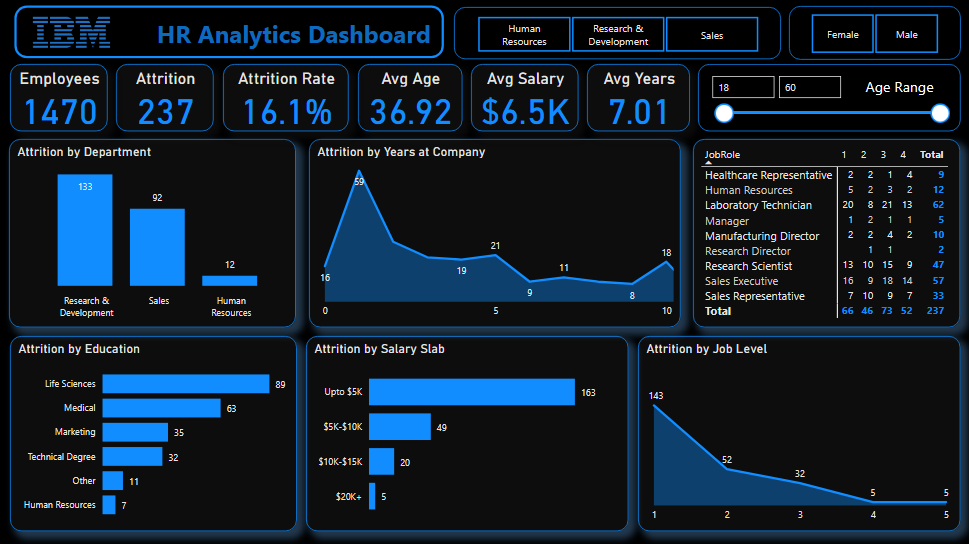
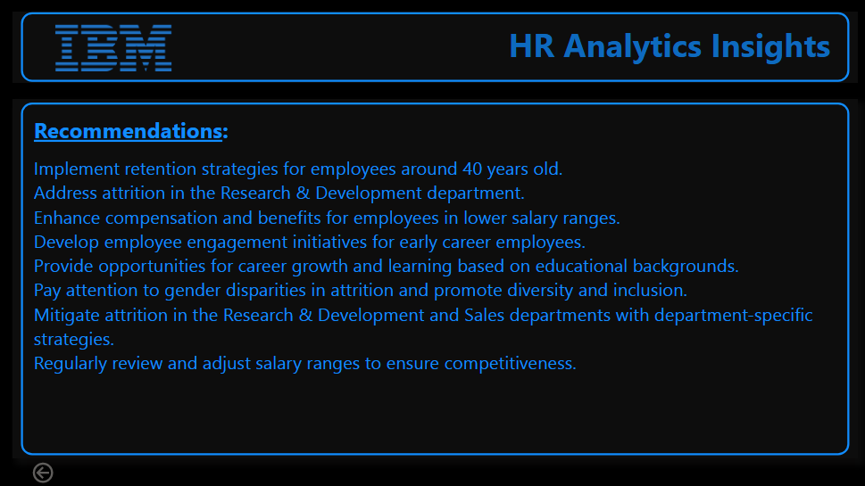
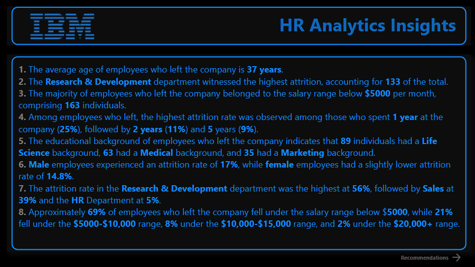

# IBM HR Analytics Dashboard

## Description

This repository contains a Power BI dashboard of IBM Employee Attrition to answer questions about the data. The insights of the dashboard can be found in the results file.  This repository can be used as a starting point for anyone who wants to learn how to use Power BI to analyze data.

## Screenshot

## Installation

To run this project on your machine you need to install <a href="https://powerbi.microsoft.com/en-us/downloads/">Microsoft Power Bi</a>.

## Tools

* Microsoft Power BI

## Badges

## Project Learnings

* Created an interactive dashboard to analyze employee performance and attrition.
* Used complex parameters to drill down in worksheet and customization using filters and slicers.
* Created columns using complex DAX queries, did calculations to manipulate data and enabled user-driven parameters for visualization.
* Used different types of customized visualization (bar chart, clustered bar chart, line chart, area chart, matrix table, slicers, KPIs etc)
* Generated insights and recommendations based on the analysis on how to improve employee retention.

## Conclusion

The project was successful in answering the set of questions about the employee's performance and attrition patterns. The results of the project can be found in the Above screenshots 

**Let's Connect:**

- Connect on LinkedIn: [Your LinkedIn Profile](https://www.linkedin.com/in/santoshkumarsk/)
- Explore more projects: [GitHub Profile](https://github.com/SantoshMalhi)
